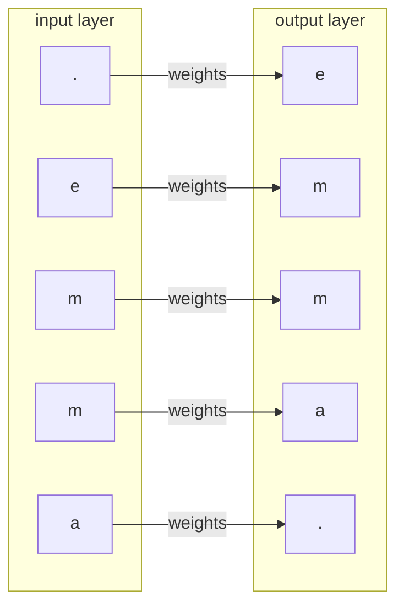
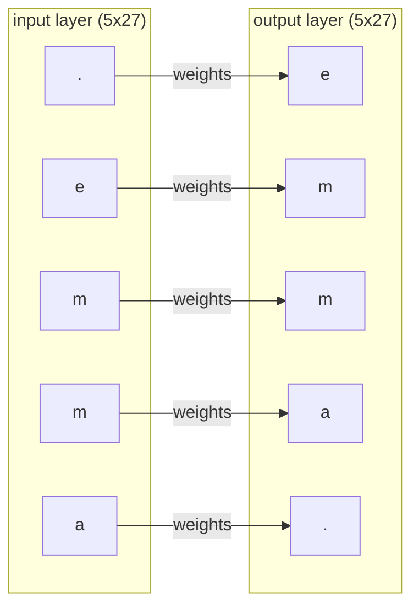

# makemore

Andrej Karpathy has a series of lectures on YouTube on building language models from the ground up. He calls his toy language model [makemore](https://github.com/karpathy/makemore).

I am watching these lectures, taking notes and doing the linked exercises.

- [makemore part 1](https://www.youtube.com/watch?v=PaCmpygFfXo)

## Notes

The premise of `makemore` is very neat. It takes a corpus of words and makes new words that are like the words you gave it. It has practical applications - generating new words, generating city names, generating fantasy character names, names of pets - and we can try successively more complex approaches to get better and better results.

### Visualizing tensors using matplotlib

Karpathy visualizes tensors using matplotlib - `plt.imshow`

```python
import torch
import matplotlib.pyplot as plt
%matplotlib inline

tensor = torch.rand((5, 10))

print(tensor)
plt.imshow(tensor, cmap='Greys')
```

This is very useful for getting big collections of numbers into my brain.

And matplotlib has a bunch of color maps to control the [resulting visualization](https://matplotlib.org/stable/tutorials/colors/colormaps.html).

### torch.multinomial

`torch.multinomial` is a neat function for sampling from a list of frequencies.

```python
import torch

freqs = torch.tensor([
    [10, 0, 0],
    [3, 3, 4],
    [1, 9, 0],
]).float()

samples = torch.multinomial(freqs, num_samples=10, replacement=True)
print(samples)
```

### verifying a model's correctness

Karpathy has trouble judging if his bigram model is correct or wrong [in the lecture](https://youtu.be/PaCmpygFfXo?t=2051).

The generated words don't look correct, and he has to judge if that's because the algorithm is bad, or there is some kind of bug in his implemenation.

He uses a random model vs his bigram model to confirm that his results are atleast somewhat reasonable. Using a random model or a trivial baseline model to compare your model seems like it's essential to avoid mistakes in ML developement.

### broadcasting

Broadcasting is when you perform a tensor operation on two tensors and the sizes are not compatible. When this happens, pytorch will copy dimensions of the smaller tensor to make it compatible with the larger tensor.

```python
import torch

a = torch.arange(15).reshape(3, 5)
print(a)

b = torch.tensor([
    [1], 
    [2], 
    [3]])
print(b)

print(a + b)
```

While this seems easy and desirable on the surface, it is easy to introduce bugs if the wrong dimension is copied.

```python
import torch

a = torch.Tensor([
    [1, 2], 
    [3, 4]])

# both s1 and s3 contain [3, 7] 
s1 = a.sum(1, keepdim=True) # s1 has shape [2, 1]
s2 = a.sum(1, keepdim=False) # s2 has shape [2]

print(a / s1) # this copies each column gives us [[1/3, 2/3], [3/7, 4/7]]
print(a / s2) # this copies each row and gives us [[1/3, 2/7], [3/3, 4/7]]
```

For this reason it is important to check your work and understand exactly how and when broadcasting will and won't work.

I did some experimentation in [this notebook](./broadcasting.ipynb) and read through the [Pytorch docs on broadcasting](https://pytorch.org/docs/stable/notes/broadcasting.html).


#### broadcasting rules by example

This example helps me understand how to verify that two tensors are broadcastable.

When performing an operation on two tensors X and Y

- if X has a shape `a x b`
- if Y has a shape `c`

We start by aligning all the dimensions to the right hand side.

```
a x b
    c
```

Then starting from the right, each dimension has to match, or has to equal 1, or it has to be missing.

In this case, `b == c` or `c == 1`.

Missing dimensions are treated like they have a dimension of 1.

Then, the smaller tensor is concatenated along the size 1 dimension to match the size of the larger tensor, and an elementwise operation is performed.

### measuring model performance

For any model, we need to know how good it is.

We can qualitatively see if the results are any good by spot checking outputs, but we can be more certain if we use a number to measure the performance.

For a language model, we will judge performance by measuring how likely the model is to predict the input corpus of text.

This sounds fancy, but for bigrams it is really simple.

If your corpus contained just one string - "emma" - the performance would be:

$$
\text {Performance} = P(.e) * P(em) * P(mm) * P(ma) * P(a.)
$$

The `.`s refer to starts and ends of a word.

#### understanding negative log likelihood

The probabilities of any given bigram are likely to be low, and we might end up multiplying a bunch of small numbers, and floating point numbers lose precision when they try to estimate really small values less than 1.

For this reason, we can instead judge the $\log$ of the model's performance. Because $\log$ is a [monotonically increasing function](https://www.wolframalpha.com/input?i=graph+of+log%28x%29), and $\log (a * b) = \log (a) + \log (b)$

$$
\text{Performance} = \log P(.e) + \log P(em) + \log P(mm) + \log P(ma) + \log P(a.)
$$

This works better with floating point numbers. 

We'll make one more change to how we measure performance - instead of measuring performance, where bigger is better, we will measure loss where smaller is better. We can get this by negating both sides

$$
\text{Loss} = -\log P(.e) - \log P(em) - \log P(mm) - \log P(ma) - \log P(a.)
$$

$\log(x)$ returns values from $-\infty \to 0$, when $x$ is between 0 and 1. Probabilities are always between 0 and 1.

This means that each $-\log(P_i)$ goes from $0 \to \infty$ and $\text{Loss}$ which is a sum of $-\log(P_i)$ is also a positive number.

This formulation of loss is called **negative log likelihood** (NLL). Each $P_i$ is a likelihood. The loss of our model on a dataset is a sum of negative log likehoods for all examples.

As a final practical matter, Karpathy uses normalized NLL in his code, which is $\frac{\text{NLL}}{\text{num examples}}$.

This has a nice property where the loss value remains roughly the same as you add more examples to the dataset. This makes it easier to judge whether a model with $\text{Loss} \sim 4$ is a good or bad model.

### Neural net based bigram

Karpathy produces a bigram model using a neural network without any explicit counting. 

Consider that we just train on the string "emma", which contains the bigrams `[.e, em, mm, ma, a.]`

At a high level, we want the neural network to take in a character, and return the next character by applying weights.



Neural networks take in numbers rather than letters so we turn the inputs and outputs into integer values. 

```
. -> 0
a -> 1
b -> 2
...
z -> 26
```

Neural networks also have a hard time predicting discrete integer values, so we turn each input letter into a vector of size 27.

```
. -> 0 -> [1, 0, 0, ..., 0]
a -> 1 -> [0, 1, 0, ..., 0]
b -> 2 -> [0, 0, 1, ..., 0]
...
z -> 26 -> [0, 0, 0, ..., 1]
```

These are called one hot encoded vectors.

Similarly, our outputs cannot be letters or integers. Each output letter will be a vector of size 27, where each element is the probability of predicting that output letter.

For example, if our network network thinks that 50% of words start with `a` and 50% of words that with `b`, then when we pass in `.` into our network, we should get back a vector of size 27 - `[0, 0.5, 0.5, 0, 0, ...., 0]`.

By transforming input and output letters into vectors, our network for "emma" starts to look like:



If we represent this as a mathematical operation, we get

$$ 
\text{output} = \text{softmax(}\text{input} * \text{weights)}
$$

To get a `5x27` output, we have to multiply a `5x27` input with `27x27` weights. This `27x27` tensor is the hidden layer of our neural network, which we will learn through gradient descent.

The softmax is necessary because we want our output to be a list of probabilities. `input * weights` will give us arbitrary integers, and `softmax` turns this into a list of integers where each row adds up to `1`.

### Similarity to the frequency based bigram implementation

The neural net model that Karpathy trains produces the exact same words as the frequency based model given the same random 
seed. 

This means that it has learned the same frequencies in its weights even though we never programmed this behavior in, which is incredible.

Another similarity between the two implementations is that the hidden layer weights are `27x27`, and so are the bigram frequencies, which makes them more likely to contain the same information.

#### Regularization as a form of smoothing

The frequency based bigram solution gets infinite loss whenever it encounters a bigram it has not seen in the training set, because it gets back a likelihood of 0, and $\log 0 = -\infty$.

To fix this problem, we initialize each bigram with a frequency of 1. Making the initial frequency larger than 1 makes the model more uniform. The larger the initial frequency, the less that our results depend on the input corpus.

In the neural network based solution, we can get a similar smoothing effect by nudging our weights towards 0. The closer our weights are to 0, the more uniform the model's outputs will be. This is also known as a regularization term, and it's neat that there's a similarity in behavior with the frequency based solution.


## Trigram Exercise

### Reimplementation of Bigram

Before doing the trigram exercise, I wanted to reimplement the bigram myself, because I expected a trigram to be a simple change on top of the bigram.

On my first attempt implementing bigram, my neural network was outputting garbage like this:

```
qvsabyuaynqlzowuzmhvbkrmluccraoe
qniwqszazohbsccnerejbdieukejdjkpqjroglegbzukr
ldew
cbijyodikjheqvktoffoqfo
dibebbithrpld
xpwvcijdkqupyfgwedxfumlkdmdkuyqgvxlrldkoprqcuouthepuegqvfgetqwxhtrazsqpecazbgblwhjaqgbniklrngdjaunckx
htynybzjdifgkbkfxzqvkoxrqrtduazazoechxrnglznxfordiorhggftcckkogbwccheumiffvfjrassrarumbezxghtq
metpdqfgqncblecbsstheci
cchiswdphcmlfufqyfoazmdjdiwenyjdbccifdmlxdru
enzxnqtpdiwhcbkegpumbxnyneecgbbl
atwlomiusjbkdrazayefpijdzotdapsvwtphumimlefvucbgbzprpqaqdkuswpuqaqjtdkkjiyeh
sjdfgqiehebxccskmithxtquvkxhtuxgbmycrucrweublncfecieoheqmiejayfowu
```

I was stuck on this for a while. I initially thought the problem was with the input text file. So I tried a list of pokemon names, because I expected those to be simpler. That didn't work either, so I switched to the original list of names from the lecture.

When I saw that this code didn't work, I knew that something was wrong with my network. 

It turned out that the bug was something like this:

```diff
# logits is a 5x27 tensor output from the neural network
-probs = logits.softmax(dim=0)
+probs = logits.softmax(dim=1)
```

In my head, I was trying to take the softmax across each row. I index into rows using the first dimension (e.g. `logits[0]` is the first row, `logits[1]` is the second row). So I figured I would take the softmax across all the rows like so: `logits.softmax(dim=0)`. I'm asking Pytorch to take a softmax across dimension 0.

It turns out that my mental model here is wrong.

The same bug would occur if I were taking a `sum` of a tensor.
#### dim parameter in pytorch functions is counterintuitive

Consider this code:

```python
a = torch.tensor([
    [1, 2, 3],
    [4, 5, 6],
])

print(a.sum(dim=0))
# what do you think this will print?
```

You might think, the 0th dimension refers to rows. So this should add up each row and print `[6, 15]`

Unfortunately, this is wrong. The code will print `[5, 7, 9]`.

Why is this?

Pytorch interprets the `dim` parameter as the parameter that is going to get *collapsed*.

So when a dimension of `0` is supplied it means that the 0th dimension is going to get collapsed, and we'll sum up over the other dimensions (in the case of a 2d tensor, we'll take a column sum).

With 2D tensors, it's not really clear why Pytorch chose this interpretation of the `dim` parameter, but it becomes more obvious with 3d tensors.

There's a handy visualization and explanation of 3d tensors and the `dim` parameter in [this blog post](https://towardsdatascience.com/understanding-dimensions-in-pytorch-6edf9972d3be).

Here's another way to correct your mental model.

`a.sum(dim=0)` is taking a sum over the first dimension, so the result will be: `a[0] + a[1] + a[2] + ...`

`a.sum(dim=1)` is taking a sum over the second dimension, so the result will be: `a[:, 0] + a[:, 1] + a[:, 2] + ...`

I hope this explanation helps you avoid this bug in your own code.
### Converting bigram to trigram

Bigram was pretty easy to convert to trigram.

The neural network changes slightly where instead of taking in a tensor of length 27, we take a tensor of length 27 * 27.

The output of the network is still 27 neurons (one for each letter).

I had to write a little bit of code to translate 2 alphabet indexes into one index

```python
letters = '.' + ''.join(sorted(set(''.join(names))))
num_letters = len(letters)

def index_2d_to_1d(ix1: int, ix2: int):
    return ix1 * num_letters + ix2

def index_1d_to_2d(ix: int) -> Tuple[int, int]:
    return ix // num_letters, ix % num_letters

# this is the index for the input 'ac' and it equals 30 when we have 27 letters
index_2d_to_1d(1, 2) 
```

Other than that, I also made the suggested changes to the neural network implementation:

- switched from one-hot vectors to indexing the weights, which is less verbose and less finnicky.

```diff
- xenc = F.one_hot(Xtr, num_classes=num_letters).float()
- logits = xenc @ W
+ logits = W[Xtr]
```

- switched the softmax + log loss calculation to using `F.cross_entropy()`, which is a lot more readable:

```diff
- probs = logits.softmax(dim=1)
- ypred = probs[torch.arange(len(ys)), ys]
- loss = -(ypred.log().mean())
+ loss = F.cross_entropy(logits, Ydev)
```

- started using minibatches to train instead of training on the full dataset, which makes the network train a lot faster.

- experimented with hyperparameter tuning like finding a learning rate and a regularization value. These tuning methods seem pretty manual to me, and it feels like I'm mostly writing loops and plotting graphs to figure out which values to pick.