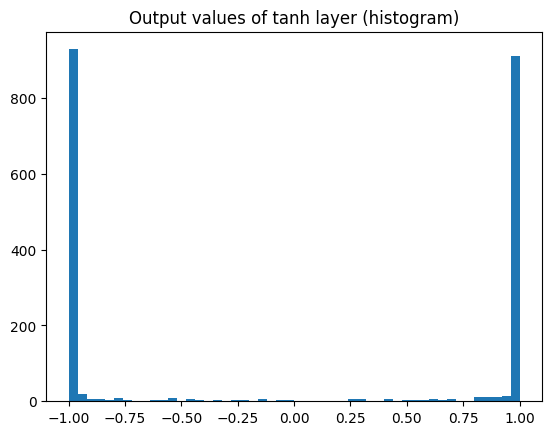

Makemore activations & gradients, BatchNorm
================

In this post, I dig deeper into the activations & gradients of the multi
layer perceptron that we built in [the previous
exercise](../003_makemore_mlp).

The goal is to improve the loss of the model by optimizing the
initialization and structure of the network.

The work in this post is based on [this
lecture](https://www.youtube.com/watch?v=P6sfmUTpUmc).

## Preparing datasets

Let’s start by reading in an input list of words and preparing our
training, dev, test datasets.

``` python
filename = 'names.txt'

def get_names():
    names = []
    for line in open(filename, 'r'):
        if line.startswith('#'):
            continue
        name = line.strip().lower()
        if not name or not name.isalpha:
            continue
        names.append(name)
    return names

words = get_names()
print(words[:10])
```

    ['emma', 'olivia', 'ava', 'isabella', 'sophia', 'charlotte', 'mia', 'amelia', 'harper', 'evelyn']

Then, we write some helpers to convert between letters and numerical
indexes.

``` python
letters = '.' + ''.join(sorted(set(''.join(words))))
num_letters = len(letters)

itol = {i: l for i, l in enumerate(letters)}
ltoi = {l: i for i, l in enumerate(letters)}

print(letters)
```

    .abcdefghijklmnopqrstuvwxyz

And a helper function to turn words into tensors.

``` python
context_size = 3 # how many letters do we see to predict the next one

def build_dataset(words):
    X, Y = [], []
    for word in words:
        # takes advantage of the fact itos[0] == '.'
        context = [0] * context_size

        for ch in word + '.':
            X.append(context)
            ix = ltoi[ch]
            Y.append(ix)

            context = context[1:] + [ix]

    return torch.tensor(X), torch.tensor(Y)

# sanity check the function
xx, yy = build_dataset(['emma'])
pp.pprint(list(zip(xx, yy)))
```

    [(tensor([0, 0, 0]), tensor(5)),
     (tensor([0, 0, 5]), tensor(13)),
     (tensor([ 0,  5, 13]), tensor(13)),
     (tensor([ 5, 13, 13]), tensor(1)),
     (tensor([13, 13,  1]), tensor(0))]

Let’s now prepare the training, dev and test datasets.

- Training - 80% of our data. Used to train the model
- Dev - 10% of our data. Used to evaluate the model, to verify that the
  model isn’t overfitting and to tune hyperparameters.
- Test - 10% of our data. Used to check that the model is going to work
  on never before seen data.

``` python
import random

random.seed(42)
random.shuffle(words)

n1 = int(len(words) * 0.8)
n2 = int(len(words) * 0.9)
```

``` python
Xtr, Ytr = build_dataset(words[:n1])
Xdev, Ydev = build_dataset(words[n1:n2])
Xtest, Ytest = build_dataset(words[n2:])

print("train shape", Xtr.shape)
print("dev shape", Xdev.shape)
print("test shape", Xtest.shape)

assert Xtr.shape[0], Ytr.shape[0]
assert Xtr.dtype == Ytr.dtype == torch.int64
```

    train shape torch.Size([182625, 3])
    dev shape torch.Size([22655, 3])
    test shape torch.Size([22866, 3])

Our datasets are ready.

## Neural network setup

Let’s train the multi layer perceptron and evaluate the network.

``` python
batch_size = 32

# changed these parameters 10 times to achieve the best loss on the dev set
training_iter = 200000
word_embedding_size = 64
hidden_layer_size = 64

class MLPBase:
    """MLPBase is the base class for all the multi layer perceptron
    models we'll try in this post to optimize our network"""

    def __init__(self):
        # C maps each letter to its embedding
        self.C = torch.randn((num_letters, word_embedding_size), generator=g)

        # W1, B1 are parameters for the embedding layer -> hidden layer
        self.W1 = torch.randn((context_size * word_embedding_size, hidden_layer_size), generator=g)
        self.B1 = torch.randn((hidden_layer_size,), generator=g)

        # W2, B2 are parameters for the hidden layer -> output layer
        self.W2 = torch.randn((hidden_layer_size, num_letters), requires_grad=True, generator=g)
        self.B2 = torch.randn((num_letters,), generator=g)

        self.params = [self.C, self.W1, self.B1, self.W2, self.B2,]
        self.named_params = {
            'C': self.C,
            'W1': self.W1, 
            'B1': self.B1,
            'W2': self.W2,
            'B2': self.B2,
        }

        for param in self.params:
            param.requires_grad = True

        self.last_H = None
        self.last_logits = None

    def __call__(self, X: torch.Tensor, training=False):
        # E is the embedding layer
        # the shape of this is num_examples * context_size * word_embedding_size
        E = self.C[X].view(-1, context_size * word_embedding_size) 

        # H is the hidden layer
        H = (E @ self.W1 + self.B1).tanh()
        self.last_H = H

        # logits from the output layer
        logits = H @ self.W2 + self.B2
        self.last_logits = logits
        return logits
    
    def zero_grad(self):
        for param in self.params:
            param.grad = None

    def optim_step(self, lr: float):
        for param in self.params:
            param.data += -lr * param.grad

    def weight_decay_value(self, c: float): # this is the regularization term
        return c * ((self.W1 ** 2).mean() + (self.W2 ** 2).mean())
```

Visually, this network looks like this:

<div>

<p>


</p>

</div>

``` python
def train_model(model, n_iter=training_iter):
    training_losses = []

    for i in tqdm(range(n_iter)):
        ix = torch.randint(0, Xtr.shape[0], (batch_size,), generator=g)
        X = Xtr[ix]
        Y = Ytr[ix]

        O = model(X, training=True)
        loss = F.cross_entropy(O, Y) + model.weight_decay_value(0.1)

        model.zero_grad()
        loss.backward()

        lr = 0.1 if i < training_iter // 2 else 0.01
        model.optim_step(lr)
        training_losses.append(loss.data)
    return training_losses

def eval_model(model):
    return F.cross_entropy(model(Xdev), Ydev).data
```

      9%|▉         | 18705/200000 [00:05<00:49, 3698.44it/s]

    KeyboardInterrupt: 

The base model gives us a dev loss of \~2.18. It’s a multi layer
perceptron where the weights are initialized using a random gaussian.

Let’s see how we can make this better. The first thing we see is that
there’s a hockey stick drop in the loss at the very beginning of
training.

    100%|██████████| 1/1 [00:00<00:00, 668.95it/s]

    tensor(19.8511)

This hockey stick drop in the loss happens because upon initialization,
the loss of this network is really high. The initial logits are randomly
favoring one character over another.

We want our network to think that all letters are roughly equally likely
at the beginning, and we want the logits to be roughly uniform.

This way we don’t waste iterations because we randomly assumed that one
letter is favored over another.

Let’s make this change and see how well it works.

``` python
class MLPReduceInitialLoss(MLPBase):
    """In MLPReduceInitialLoss, we'll initialize our network to have
    a lower initial loss

    We'll do this by scaling the initial weights"""

    def __init__(self):
        super().__init__()

        # we scale the hidden layer weights by 0.01 to avoid large logit values initially
        # we initialize our bias to 0

        self.W2 = torch.randn((hidden_layer_size, num_letters)) * 0.01
        self.B2 = torch.randn((num_letters)) * 0

        self.params = [self.C, self.W1, self.B1, self.W2, self.B2]

        for param in self.params:
            param.requires_grad = True
```

    100%|██████████| 1/1 [00:00<00:00, 900.07it/s]

    tensor(3.4102)

    <matplotlib.legend.Legend at 0x28b990310>


Now, our probabilities are a lot closer to uniform and our initial loss
is a lot closer to $-\log \frac{1}{27}$.

Let’s see if this improves the model when trained for 200k iterations.

The dev loss we are trying to beat is \~2.18.

    100%|██████████| 200000/200000 [00:53<00:00, 3729.61it/s]

    tensor(2.1788)


In the lecture, the next thing Karpathy does is look at the activations
for the tanh layer to make sure that the tanh neuron is not saturated.

    100%|██████████| 1/1 [00:00<00:00, 275.72it/s]

    Text(0.5, 1.0, 'black = >0.99, white = <0.99')


    Text(0.5, 1.0, 'Output values of tanh layer (histogram)')



The distribution of tanh outputs looks saturated here. This is because
tanh is a squashing function.

When the outputs of tanh are this large, it means that the weights of
the layer going into the tanh must be too large.

Let’s fix this.

``` python
class MLPReduceTanhSaturation(MLPReduceInitialLoss):
    """In MLPReduceTanhSaturation, we'll fix the saturation of the tanh
    layer by scaling the initial weights of the layer going into the hidden
    layer"""

    def __init__(self):
        super().__init__()

        # W1, B1 are parameters for the embedding layer -> hidden layer
        self.W1 = torch.randn((context_size * word_embedding_size, hidden_layer_size), generator=g) * 0.1
        self.B1 = torch.randn((hidden_layer_size,), generator=g) * 0.01

        self.params = [self.C, self.W1, self.B1, self.W2, self.B2]

        for param in self.params:
            param.requires_grad = True
```

    100%|██████████| 1/1 [00:00<00:00, 1122.37it/s]

    Text(0.5, 0.9, 'black = >0.99, white = <0.99')


The tanh saturation seems fixed now. Let’s see how much this improves
our metrics.

    100%|██████████| 200000/200000 [00:56<00:00, 3522.33it/s]

    tensor(2.1235, grad_fn=<NllLossBackward0>)


That improves things quite a bit from our original loss!

<div>
<style scoped>
    .dataframe tbody tr th:only-of-type {
        vertical-align: middle;
    }

    .dataframe tbody tr th {
        vertical-align: top;
    }

    .dataframe thead th {
        text-align: right;
    }
</style>
<table border="1" class="dataframe">
  <thead>
    <tr style="text-align: right;">
      <th></th>
      <th>loss</th>
    </tr>
    <tr>
      <th>model</th>
      <th></th>
    </tr>
  </thead>
  <tbody>
    <tr>
      <th>MLPBase</th>
      <td>tensor(15.4808)</td>
    </tr>
    <tr>
      <th>MLPReduceInitialLoss</th>
      <td>tensor(3.2817)</td>
    </tr>
    <tr>
      <th>MLPReduceTanhSaturation</th>
      <td>tensor(2.1235)</td>
    </tr>
  </tbody>
</table>
</div>

That improves things quite a bit from our original loss!

These scaling number we’re choosing seem a bit arbitrary. Let’s try to
make them more systematic by using `torch.nn.init.kaiming_normal_` which
is based on [this research paper](https://arxiv.org/pdf/1502.01852.pdf).

``` python
class MLPKaimingNormal(MLPReduceInitialLoss):
    """MLPBase is the base class for all the multi layer perceptron
    models we'll try in this post to optimize our network"""

    def __init__(self):
        super().__init__()

        # W1, B1 are parameters for the embedding layer -> hidden layer
        self.W1 = torch.randn((context_size * word_embedding_size, hidden_layer_size), generator=g)
        torch.nn.init.kaiming_normal_(self.W1, nonlinearity='tanh')
        self.B1 = torch.randn((hidden_layer_size,), generator=g) * 0.01

        self.params = [self.C, self.W1, self.B1, self.W2, self.B2,]

        for param in self.params:
            param.requires_grad = True
```

    100%|██████████| 1/1 [00:00<00:00, 951.74it/s]


    100%|██████████| 200000/200000 [01:03<00:00, 3158.63it/s]

    tensor(2.1296, grad_fn=<NllLossBackward0>)


Kaiming’s performance is pretty comparable to manually reducing tanh
saturation.

Next, we’ll try batch normalization. This idea came from [this
paper](https://arxiv.org/pdf/1502.03167.pdf) where instead of trying to
cleverly initialize the network to make the input to hidden layers a
Gaussian distribution, we force them to be Gaussian in the initial
iterations of training and slowly learn over time to become
non-Gaussian.

``` python
class MLPBatchNormal(MLPReduceInitialLoss):
    """In MLPBatchNorm, we'll add a batch normalization
    step inside our neural network to force the
    inputs of the hidden layer to be Gaussian
    a lower initial loss

    We'll do this by scaling the initial weights"""

    def __init__(self):
        super().__init__()

        # we don't need a bias anymore 
        self.W1 = torch.randn((context_size * word_embedding_size, hidden_layer_size), generator=g) 
        torch.nn.init.kaiming_normal_(self.W1, nonlinearity='tanh')

        self.bngain = torch.ones((hidden_layer_size, ))
        self.bnbias = torch.zeros((hidden_layer_size, ))

        self.bnmean_running = torch.zeros((hidden_layer_size, ))
        self.bnstd_running = torch.ones((hidden_layer_size, ))

        self.last_bnmean = None
        self.last_bnstd = None

        self.params = [self.C, self.W1, self.bngain, self.bnbias, self.W2, self.B2,]

        for param in self.params:
            param.requires_grad = True

    def __call__(self, X: torch.Tensor, training=False):
        # E is the embedding layer
        # the shape of this is num_examples * context_size * word_embedding_size
        E = self.C[X].view(-1, context_size * word_embedding_size) 

        # H is the hidden layer
        hpreact = E @ self.W1 + self.B1

        if training:
            self.last_bnmean = hpreact.mean(0, keepdim=True)
            self.last_bnstd = hpreact.std(0, keepdim=True)

            hnorm = self.bngain * (hpreact - self.last_bnmean) / self.last_bnstd + self.bnbias
        else:
            hnorm = self.bngain * (hpreact - self.bnmean_running) / self.bnstd_running + self.bnbias


        H = hnorm.tanh()
        self.last_H = H

        # logits from the output layer
        logits = H @ self.W2 + self.B2
        self.last_logits = logits
        return logits
    
    def optim_step(self, lr: float):
        for param in self.params:
            param.data += -lr * param.grad

        with torch.no_grad():
            self.bnmean_running = self.bnmean_running * 0.99 + self.last_bnmean * 0.01
            self.bnstd_running = self.bnstd_running * 0.99 + self.last_bnstd * 0.01

```

    100%|██████████| 200000/200000 [01:29<00:00, 2226.92it/s]

    tensor(2.1327, grad_fn=<NllLossBackward0>)

Hmm, this is not quite as good as our manual initialization to fix tanh
saturation.

I’m not totally sure why this is, but I want to move on to the pytorch
API for these networks. I feel that the Pytorch API might help me
visualize the gradients and activations of the networks, which would
help me experiment with different architectures more easily.

    TypeError: Linear.__init__() takes 1 positional argument but 3 were given

    100%|██████████| 1/1 [00:00<00:00, 809.71it/s]

    [tensor(2.1694)]

## Generate new words

Let’s see what kinds of words our model generates.

<details>
<summary>Code</summary>

``` python
for i in range(10):
    
    context = [0] * context_size
    word = ''

    while True:
        logits = m(torch.tensor(context))
        # sanity check
        assert logits.shape == (1, num_letters)

        probs = logits.softmax(dim=1)
        # sanity check
        np.testing.assert_almost_equal(probs[0].sum().item(), 1, decimal=3)

        next_letter_ix = torch.multinomial(probs, num_samples=1, replacement=True, generator=g)
        letter = itol[next_letter_ix.item()]

        if letter == '.':
            break

        word += letter
        context = context[1:] + [ next_letter_ix ]
    print(word)
```

</details>

I’d say these are half decent. Definitely far from random. Our model did
learn something after all.
